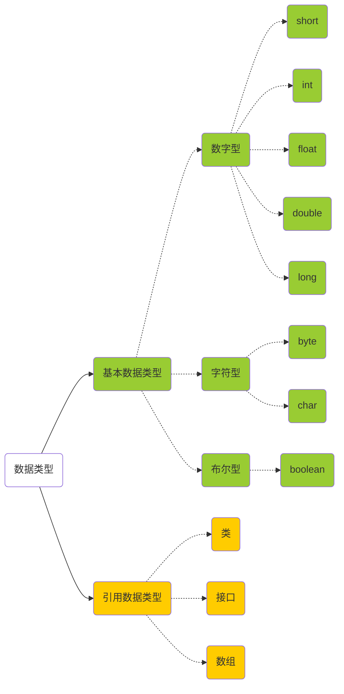

# 第1节：数据类型

> - 基本数据类型（内置数据类型）
> - 引用数据类型

```mermaid
flowchart LR
   style Start fill:#fff
   style A fill:#9c3
   style A1 fill:#9c3
   style A2 fill:#9c3
   style A3 fill:#9c3
   style short fill:#9c3
   style int fill:#9c3
   style float fill:#9c3
   style double fill:#9c3
   style long fill:#9c3
   style byte fill:#9c3
   style char fill:#9c3
   style boolean fill:#9c3
  
   style B fill:#fc0
   style Class fill:#fc0
   style Interface fill:#fc0
   style Array fill:#fc0

   Start(数据类型)-->A(基本数据类型)
   A(基本数据类型)-.->A1(数字型)-.-> short(short) & int(int) & float(float) & double(double) & long(long)
   A(基本数据类型)-.->A2(字符型)-.-> byte(byte) & char(char)
   A(基本数据类型)-.->A3(布尔型)-.-> boolean(boolean)

   Start(数据类型)-->B(引用数据类型)
   B(引用数据类型)-.-> Class(类) & Interface(接口) & Array(数组)
```