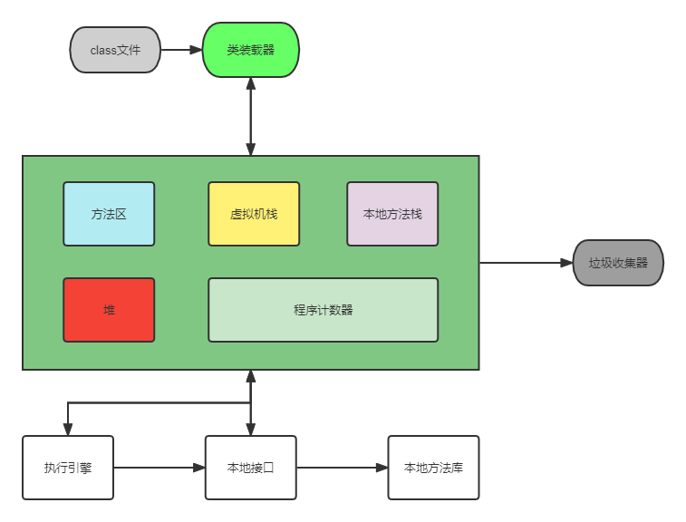

# 第4节 多线程
> 关于 进程和线程的概念，推荐一篇比较优秀的 [文章](https://www.ruanyifeng.com/blog/2013/04/processes_and_threads.html)，有助于帮助你理解进程和线程的概念

### 1）、 内存结构
> 进程可以细化为多个线程。 `每个线程，拥有自己独立的：栈、程序计数器` 多个线程，共享同一个进程中的结构：方法区、堆。

