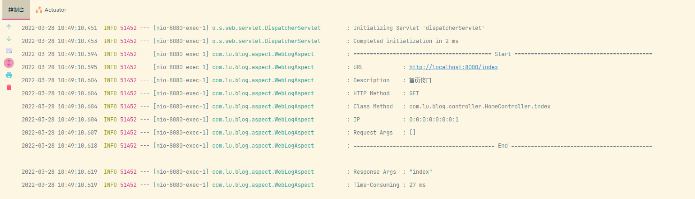
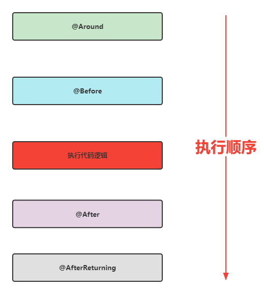

# 自定义注解，AOP 切面统一打印出入参请求日志

### 一、日志输出效果

- URL: 请求接口地址；
- Description: 接口的中文说明信息；
- HTTP Method: 请求的方法，是 POST, GET, 还是 DELETE 等；
- Class Method: 被请求的方法路径 : 包名 + 方法名;
- IP: 请求方的 IP 地址；
- Request Args: 请求入参，以 JSON 格式输出；
- Response Args: 响应出参，以 JSON 格式输出；
- Time-Consuming: 请求耗时，以此估算每个接口的性能指数；
  
### 二、添加 AOP Maven 依赖

```xml
<!-- aop 依赖 -->
<dependency>
    <groupId>org.springframework.boot</groupId>
    <artifactId>spring-boot-starter-aop</artifactId>
</dependency>

<!-- 用于日志切面中，以 json 格式打印出入参 -->
<dependency>
    <groupId>com.google.code.gson</groupId>
    <artifactId>gson</artifactId>
    <version>2.9.0</version>
</dependency>
```
### 三、自定义日志注解

```java
package com.lu.blog.annotation;

import java.lang.annotation.*;

@Retention(RetentionPolicy.RUNTIME)// 注解的生命周期为 运行时
@Documented
@Target({ElementType.METHOD}) //注解作用于方法上
public @interface WebLog {// 注解名称 WebLog
    /**
     * 日志描述 定义的属性值 默认为空
     * @return
     */
    String description() default "";

}

```

### 四、配置 AOP 切面
> 在配置 AOP 切面之前，我们需要了解下 aspectj 相关注解的作用:
- @Aspect：声明该类为一个注解类；
- @Pointcut：定义一个切点，后面跟随一个表达式，表达式可以定义为切某个注解，也可以切某个 package 下的方法;
- @Before: 在切点之前，织入相关代码；
- @After: 在切点之后，织入相关代码;
- @AfterReturning: 在切点返回内容后，织入相关代码，一般用于对返回值做些加工处理的场景；
- @AfterThrowing: 用来处理当织入的代码抛出异常后的逻辑处理;
- @Around: 环绕，可以在切入点前后织入代码，并且可以自由的控制何时执行切点；



接下来，定义一个 WebLogAspect.java 切面类，声明一个切点:
```java
    @Pointcut("@annotation(com.lu.blog.annotation.WebLog)") //此处为 WebLog 注解全路径
    public void webLog(){};
```
然后，定义 @Around 环绕，用于何时执行切点：
```java
    @Around("webLog()")
    public Object doAround(ProceedingJoinPoint proceedingJoinPoint) throws Throwable {
        long startTime = System.currentTimeMillis(); // 1. 记录一下调用接口的开始时间
        //2. 执行切点，执行切点后，会去依次调用 @Before -> 接口逻辑代码 -> @After -> @AfterReturning；
        Object result = proceedingJoinPoint.proceed(); 
        //3. 打印出参
        logger.info("Response Args  : {}", new Gson().toJson(result));
        //4. 执行耗时
        logger.info("Time-Consuming : {} ms", System.currentTimeMillis() - startTime);
        //5. 返回接口返参结果
        return result;
    }   
```
再来看看 @Before 方法:
```java
    /**
     * 在切点之前织入
     * @param joinPoint
     * @throws Throwable
     */
    @Before("webLog()")
    public void doBefore(JoinPoint joinPoint) throws Throwable {
        // 开始打印请求日志
        ServletRequestAttributes attributes = (ServletRequestAttributes) RequestContextHolder.getRequestAttributes();
        HttpServletRequest request = attributes.getRequest();

        // 获取 @WebLog 注解的描述信息
        String methodDescription = getAspectLogDescription(joinPoint);

        // 打印请求相关参数
        logger.info("========================================== Start ==========================================");
        // 打印请求 url
        logger.info("URL            : {}", request.getRequestURL().toString());
        // 打印描述信息
        logger.info("Description    : {}", methodDescription);
        // 打印 Http method
        logger.info("HTTP Method    : {}", request.getMethod());
        // 打印调用 controller 的全路径以及执行方法
        logger.info("Class Method   : {}.{}", joinPoint.getSignature().getDeclaringTypeName(), joinPoint.getSignature().getName());
        // 打印请求的 IP
        logger.info("IP             : {}", request.getRemoteAddr());
        // 打印请求入参
        logger.info("Request Args   : {}", new Gson().toJson(joinPoint.getArgs()));
    }

```
最后，定义@After:
```java
    /**
     * 在切点之后织入
     * @throws Throwable
     */
    @After("webLog()")
    public void doAfter() throws Throwable {
        // 接口结束后换行，方便分割查看
        logger.info("=========================================== End ===========================================" + LINE_SEPARATOR);
    }
```

完整代码示例：
```java
package com.lu.blog.aspect;

import com.google.gson.Gson;
import com.lu.blog.annotation.WebLog;
import org.aspectj.lang.JoinPoint;
import org.aspectj.lang.ProceedingJoinPoint;
import org.aspectj.lang.annotation.*;
import org.slf4j.Logger;
import org.slf4j.LoggerFactory;
import org.springframework.context.annotation.Profile;
import org.springframework.stereotype.Component;
import org.springframework.web.context.request.RequestContextHolder;
import org.springframework.web.context.request.ServletRequestAttributes;

import javax.servlet.http.HttpServletRequest;
import java.lang.reflect.Method;

@Aspect
@Component
@Profile({"dev","test"}) // 指定了只能作用于 dev 开发环境和 test 测试环境，生产环境 prod 是不生效的！
public class WebLogAspect {

    private final static Logger logger         = LoggerFactory.getLogger(WebLogAspect.class);
    /** 换行符 */
    private static final String LINE_SEPARATOR = System.lineSeparator();

    @Pointcut("@annotation(com.lu.blog.annotation.WebLog)")
    public void webLog(){};

    /**
     * 在切点之前织入
     * @param joinPoint
     * @throws Throwable
     */
    @Before("webLog()")
    public void doBefore(JoinPoint joinPoint) throws Throwable {
        // 开始打印请求日志
        ServletRequestAttributes attributes = (ServletRequestAttributes) RequestContextHolder.getRequestAttributes();
        HttpServletRequest request = attributes.getRequest();

        // 获取 @WebLog 注解的描述信息
        String methodDescription = getAspectLogDescription(joinPoint);

        // 打印请求相关参数
        logger.info("========================================== Start ==========================================");
        // 打印请求 url
        logger.info("URL            : {}", request.getRequestURL().toString());
        // 打印描述信息
        logger.info("Description    : {}", methodDescription);
        // 打印 Http method
        logger.info("HTTP Method    : {}", request.getMethod());
        // 打印调用 controller 的全路径以及执行方法
        logger.info("Class Method   : {}.{}", joinPoint.getSignature().getDeclaringTypeName(), joinPoint.getSignature().getName());
        // 打印请求的 IP
        logger.info("IP             : {}", request.getRemoteAddr());
        // 打印请求入参
        logger.info("Request Args   : {}", new Gson().toJson(joinPoint.getArgs()));
    }

    /**
     * 在切点之后织入
     * @throws Throwable
     */
    @After("webLog()")
    public void doAfter() throws Throwable {
        // 接口结束后换行，方便分割查看
        logger.info("=========================================== End ===========================================" + LINE_SEPARATOR);
    }


    @Around("webLog()")
    public Object doAround(ProceedingJoinPoint proceedingJoinPoint) throws Throwable {
        long startTime = System.currentTimeMillis();
        Object result = proceedingJoinPoint.proceed();
        // 打印出参
        logger.info("Response Args  : {}", new Gson().toJson(result));
        // 执行耗时
        logger.info("Time-Consuming : {} ms", System.currentTimeMillis() - startTime);
        return result;
    }

    /**
     * 获取切面注解的描述
     *
     * @param joinPoint 切点
     * @return 描述信息
     * @throws Exception
     */
    public String getAspectLogDescription(JoinPoint joinPoint)
            throws Exception {
        String targetName = joinPoint.getTarget().getClass().getName();
        String methodName = joinPoint.getSignature().getName();
        Object[] arguments = joinPoint.getArgs();
        Class targetClass = Class.forName(targetName);
        Method[] methods = targetClass.getMethods();
        StringBuilder description = new StringBuilder("");
        for (Method method : methods) {
            if (method.getName().equals(methodName)) {
                Class[] clazzs = method.getParameterTypes();
                if (clazzs.length == arguments.length) {
                    description.append(method.getAnnotation(WebLog.class).description());
                    break;
                }
            }
        }
        return description.toString();
    }

}

```

五、如何使用？
```java
    @GetMapping("/index")
    @WebLog(description = "首页接口")
    public String index(){
        return "index";
    }
```